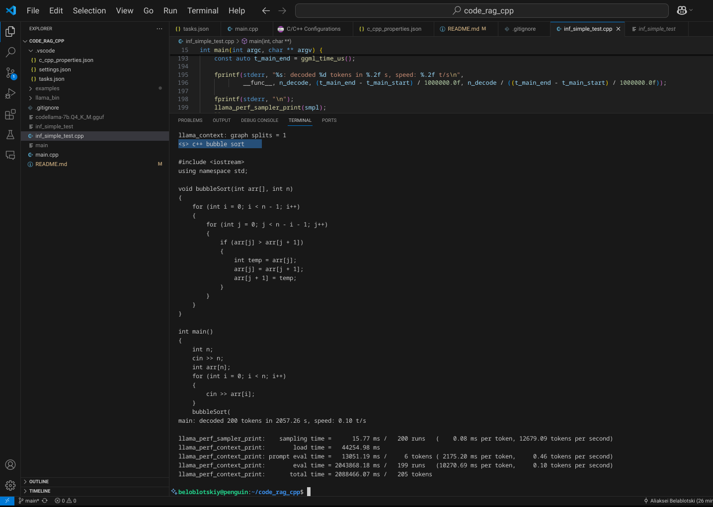

# code_rag_cpp

## Build llama.cpp

1. https://github.com/ggml-org/llama.cpp?tab=readme-ov-file#building-the-project
2. Build locally https://github.com/ggml-org/llama.cpp/blob/master/docs/build.md
3. Or download release zip from https://github.com/ggml-org/llama.cpp/releases

```
cmake -B build
cmake --build build --config Release
```

or

```
make clean
make
```

Since I had contstant problems with libggml_backend.so, I've ended up with downloading pre-built binaries from
https://github.com/ggml-org/llama.cpp/releases/download/b5501/llama-b5501-bin-ubuntu-x64.zip

Update GCC build task:

```
"args": [
                "-g",
				"${file}",
				"-o",
			    "${fileDirname}/${fileBasenameNoExtension}",
				"-I",
				"/home/beloblotskiy/llama.cpp/include",
				"-I",
				"/home/beloblotskiy/llama.cpp/ggml/include",
				"-L",
				"/home/beloblotskiy/llama.cpp/build/bin",
				"-L",
				"/home/beloblotskiy/code_rag_cpp/llama_bin",
				"-lllama",
				"-lggml-base",
				"-lggml",
				"-ldl",
				"-pthread"
			]
```

## Download LLM

```
wget https://huggingface.co/TheBloke/CodeLlama-7B-GGUF/resolve/main/codellama-7b.Q4_K_M.gguf
```

## Run simple inferencing

```
./inf_simple_test -m codellama-7b.Q4_K_M.gguf -n 200 'c++ bubble sort'
```



